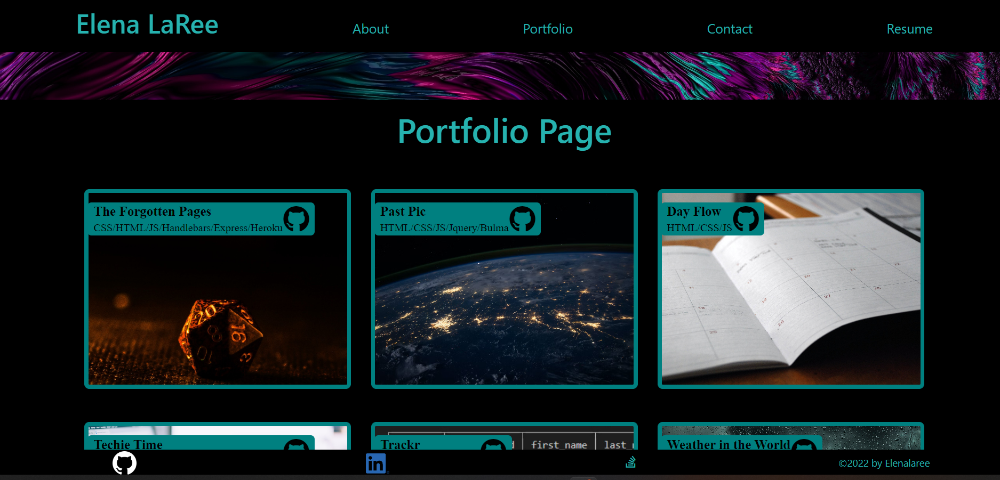

# Xceptionally Xtra
[Xceptionally Xtra website](https://elenalaree.github.io/xceptionallyxtra/)

## Description 

Xceptionally Xtra is a React based Portfolio. It was created with the intention of marketing a developer to possible employers. 

This project was bootstrapped with [Create React App](https://github.com/facebook/create-react-app). It was made with a combination of CSS, HTML, Bootstrap, React, Javascript, and react packages. It was deployed on GitHub pages. The Porfolio page was made using mapping to display projects.

## Table of Contents 
  
[Description](#description)
[Installation](#installation)
[Usage](#usage)
[License](#license)
[Contribute](#contribute)
[Questions](#questions)
[Scripts](#Scripts)

## Installation
  
  Using github, clone down the repository. Use Scripts found below to run website.
  
## Usage
  
This page is a portfolio page and should only be used with permission from the creator. With permission, it could be used to create other portfolio pages.
  
## License
  
No License
  
## Contribute
  
  Nothing may be contributed
  
  ## Questions
  
  GitHub: [Elenalaree](https://github.com/elenalaree)

  

## Available Scripts

In the project directory, you can run:

### `npm start`

Runs the app in the development mode.\
Open [http://localhost:3000](http://localhost:3000) to view it in your browser.

The page will reload when you make changes.\
You may also see any lint errors in the console.

### `npm test`

Launches the test runner in the interactive watch mode.\
See the section about [running tests](https://facebook.github.io/create-react-app/docs/running-tests) for more information.

### `npm run build`

Builds the app for production to the `build` folder.\
It correctly bundles React in production mode and optimizes the build for the best performance.

The build is minified and the filenames include the hashes.\
Your app is ready to be deployed!

See the section about [deployment](https://facebook.github.io/create-react-app/docs/deployment) for more information.
